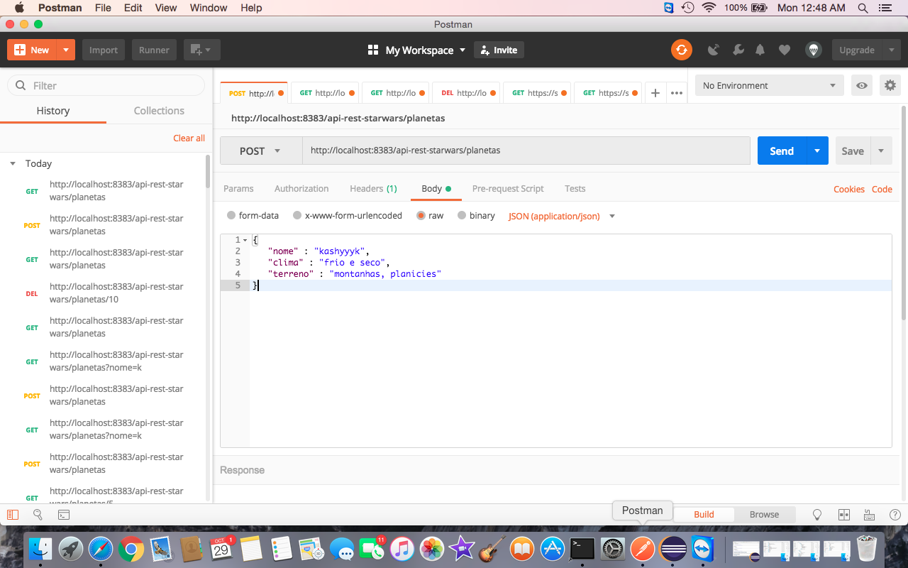
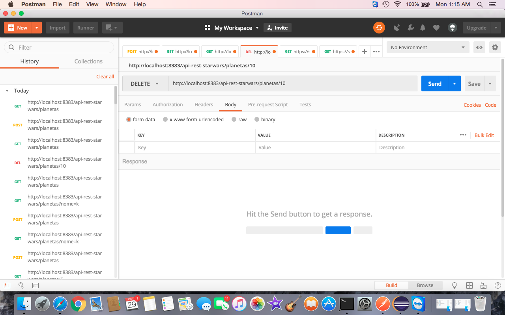

#Projeto: apirest

Aplicação de exemplo que fornce uma API Rest para realizar operações de CRUD na Entidade de  **Planeta** (Inspirada na saga Star Wars)
 
Para o desenvolvimento deste projeto adotou-se a linguagem Java (versão 8) e o framework spring-boot, que além prover funcionalidades como injeção de dependência, controle declarativo de transações e ORM (para o caso de bancos relacionais), bem como classes de persistência para diversos bancos NoSQL, ele também proporciona criar uma aplicação auto-executável, seguindo o príncipio de "*Convenção sobre Configuração*"

		Pacote Gerado: apirest.jar

**Jar auto-executável:**

Este projeto não depende de um container Web externo para colocar disponbilizar os endpoints da api rest, pois estes são publicados num container (*tomcat embeded*) embarcado internamente no pacote  api-rest.jar

		Versão Spring-Boot: 2.0.6

#Resumo dos Pré-Requisitos
 * Linguagem: Java (jdk1.8.0))
 * Ferramenta de Build: Maven (3.5.1)
 * Banco: MongoDB (3.6.8)
	
 	
# MongoDB
* Versão 3.6.8
* Repositório adotado: **mlab** (*Database-As-A-Service* armazenado na nuvem), https://mlab.com/databases/dbsw#collections
    * Host: **ds241493.mlab.com**
    * Porta: **41493**
    * Banco: **dbsw**
* Coleções:
    * Planetas: Para armazenado de objetos ou instâncias da entidade Planeta
    * Sequences: Para emular sequences do modelo relacional, fornecendo valores numéricos e sequenciais para preencher ID da coleção Planeta 
 	
# Coleções

**Planetas:**
Para armazenado de objetos ou instâncias da entidade Planeta
* campos:
    * id: Código sequencial (long)
    * nome: Nome do planeta (String), utilizado como campo indexado (Visando não permitir inserção de planetas com mesmo nome)
    * clima: Descrição do(s) tipo(s) de clima(s) (String)
    * terreno: Descrição do(s) tipo(s) de relevo(s) (String)
    * filmes: Lista de Strings contendo nomes dos episódios nos quais o planeta em questão é referenciado 
    
    
`Java:` 

```
@Document(collection="planetas")
public class Planeta {
	
	@Id
	private long id;
	
	@Indexed(unique = true)
	private String nome;
	
	private String clima;
	private String terreno;
	
	private List<String> filmes = new ArrayList<>();
```

`Exemplo Documento na base MongoDB:`

```
{
    "_id": 12,
    "nome": "tatooine",
    "clima": "frio e seco",
    "terreno": "montanhas, planicies",
    "filmes": [
        "Attack of the Clones",
        "The Phantom Menace",
        "Revenge of the Sith",
        "Return of the Jedi",
        "A New Hope"
    ],
    "_class": "com.starwars.apirest.dominio.Planeta"
}
```

**Sequences:**
Para emular sequences do modelo relacional, fornecendo valores numéricos e sequenciais para preencher ID da coleção Planeta 

* campos:
    * id: Código gerenciado pelo próprio MongoDB
    * entidade: Nome do entidade para qual está sendo controlado geração de sequence
    * nextval: Valor de sequence que será atribuído ao campo ID (Ex: Para coleção Planeta)

`Java:` 

```
@Document(collection="sequences")
public class Sequencia {
	
	@Id
	private Object id;
	
	@Indexed(unique=true)
	private String entidade;
	
	private long nextVal;
```

`Exemplo Documento na base MongoDB:`

```
{
    "_id": {
        "$oid": "5bd561b31cb1835946eaba66"
    },
    "entidade": "com.starwars.apirest.dominio.Planeta",
    "nextVal": 15
}
```

 
#Geração Pacote apirest.jar

**Observação:**

    Caso seja necessário alterar porta http no qual API Rest estará ativa, ou mesmo apontar aplicação 
    para outra base, as configurações estão localizadas no arquivo 
    apirest/src/main/resources/aplication.properties
    

**porta http:**

```
server.port=8383
```

**configurações conexão banco:**

```
spring.data.mongodb.host=ds241493.mlab.com
spring.data.mongodb.port=41493
#spring.data.mongodb.authentication-database=[authentication_database]
spring.data.mongodb.username=[user]
spring.data.mongodb.password=[pass]
spring.data.mongodb.database=dbsw
```

**Processo de build:**

```
git https://github.com/newtoncarvalho/desafio_star_wars.git
cd desafio_star_wars
cd apirest
mvn clean install
```

#Execução (Colocar endpoints no ar)

```
cd apirest
mvn spring-boot:run
```

**ou** 

```
cd apirest
cd target
java -jar apirest.jar
```

#Endpoints


** Método GET:**

* Recupera todos os planetas

```
http://localhost:8383/api-rest-starwars/planetas/
```

* Recupera planetas por nome

```
http://localhost:8383/api-rest-starwars/planetas?nome=[nome planeta]
```

* Recupera planeta por id

```
http://localhost:8383/api-rest-starwars/[id]

exemplo: http://localhost:8383/api-rest-starwars/100

```

**Método POST:**


* Insere Planeta

```
http://localhost:8383/api-rest-starwars/planetas
```

**Método DELETE:**


* Remove planeta por Id

```
http://localhost:8383/api-rest-starwars/planetas/1
```

#Operações de Inserção e Remoção de Planeta

Para realizar testar as operações baseadas no método Post, como inserção e remoção, utilizou-se a ferramenta Postman (https://www.getpostman.com/apps).

**Inserçao: Baseada na montagem de Parâmetros JSON**

<ul>
	<li>Informar campos pertinentes a coleção Planetas
		<ul>
			<li>nome</li>
			<li>clima</li>
			<li>terreno</li>
		</ul>
	</li>	
	<li>Definir parâmetro"Body"
		<ul>
			<li>raw</li>
			<li>JSON (application/json)</li>
		</ul>
	</li>
</ul>




Observação: Durante este processo são utlizados os endpoints 
*https://swapi.co/api/planets?search=<nome>* e *https://swapi.co/api/films/<id>* para recuperar filmes eventualmente relacionados ao planeta que está sendo cadastrado.


<br/>


**Deleção **

<ul>
	<li>Informar método DELETE</li>
	<li>Preencher URI Endpoint</li>
</ul>

<br/>



#Scripts MongoDB

Caso necessário, os seguintes scripts podem ser importados para popular a base dbsw 
(Via mongoimport).

[planeta.json](scripts_mongodb/planetas.json)

[sequences.json](scripts_mongodb/sequences.json)


  